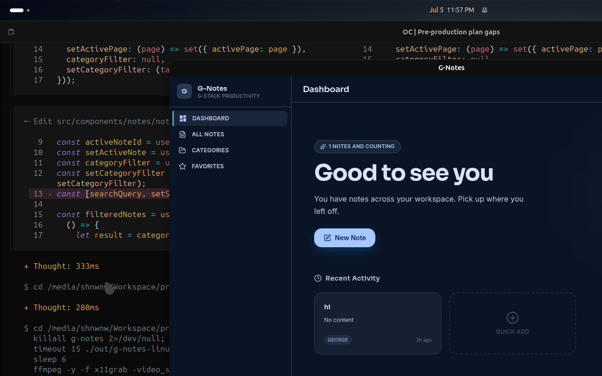

<div align="center">
  
  <h1 align="center">G-Notes</h1>
  <p align="center">
    A private, offline-first notes app powered by SQLite and EditorJS.
    <br />
    <strong>100% local. No account. No telemetry.</strong>
  </p>
  <p align="center">
    <a href="#features">Features</a> •
    <a href="#download">Download</a> •
    <a href="#building-from-source">Build</a> •
    <a href="#tech-stack">Tech Stack</a> •
    <a href="#privacy">Privacy</a>
  </p>
  <p align="center">
    
    
    
  </p>
</div>

<br />

<!-- Screenshots: add screenshots/dashboard.png to the repo to enable -->

## Features

- **Rich text editing** — Headings, bold, italic, underline, lists, checklists, quotes, code blocks, inline markers
- **Full-text search** — Instant search across all notes with highlighted results (SQLite FTS5)
- **Categories** — Organize notes with custom tags. Filter by category.
- **Favorites & Pins** — Star important notes and pin them to the top.
- **Export / Import** — Full JSON export/import. Your data is portable.
- **Auto-backup** — Periodic SQLite snapshots to `~/.config/g-notes/backups/`
- **Auto-update** — Seamless updates via GitHub Releases.
- **Keyboard shortcuts** — Full keyboard navigation with app menu.
- **Offline-first** — Zero network calls. Everything runs locally.
- **No account required** — No sign-up, no telemetry, no data collection.

## Download

| Platform | Package | Download |
|----------|---------|----------|
| **macOS** | `.zip` | [Latest release](https://github.com/gstack-dev/G-Notes/releases/latest) |
| **Windows** | `.exe` (NSIS installer) | [Latest release](https://github.com/gstack-dev/G-Notes/releases/latest) |
| **Linux** | `.deb` / `.rpm` | [Latest release](https://github.com/gstack-dev/G-Notes/releases/latest) |

Or install via homebrew (coming soon):

```bash
brew install shnwnw/tap/g-notes
```

## Building from Source

```bash
git clone https://github.com/gstack-dev/G-Notes.git
cd g-notes
npm install
npm run make     # produces distributables in out/make/
```

For development:

```bash
npm start        # launches Electron with hot-reload
```

<!-- ## Screenshots

| Dashboard | Editor | Categories | Search |
|-----------|--------|------------|--------|
|  |  |  |  |

| Settings | Export | Notes | Favorites |
|----------|--------|-------|-----------|
|  |  |  |  -->

## Tech Stack

- **Framework**: [Electron](https://www.electronjs.org/) + [React](https://react.dev/) + [TypeScript](https://www.typescriptlang.org/)
- **Editor**: [EditorJS](https://editorjs.io/) v2
- **Database**: [better-sqlite3](https://github.com/WiseLibs/better-sqlite3) with FTS5 full-text search
- **Styling**: [Tailwind CSS](https://tailwindcss.com/) v4
- **State**: [Zustand](https://github.com/pmndrs/zustand)
- **Packaging**: [Electron Forge](https://www.electronforge.io/) with Webpack
- **Icons**: [Lucide](https://lucide.dev/)
- **Fonts**: Inter, Sora, JetBrains Mono (self-hosted)

## Privacy

G-Notes is **100% offline**. All data is stored locally in a SQLite database at:

- **Linux**: `~/.config/g-notes/g-notes.db`
- **macOS**: `~/Library/Application Support/g-notes/g-notes.db`
- **Windows**: `%APPDATA%/g-notes/g-notes.db`

- ✅ No analytics
- ✅ No telemetry
- ✅ No account required
- ✅ No network requests at startup
- ✅ No data leaves your machine (unless you explicitly export or click a link)

See [PRIVACY.md](PRIVACY.md) for details.

## Keyboard Shortcuts

| Shortcut | Action |
|----------|--------|
| `Cmd/Ctrl + N` | New note |
| `Cmd/Ctrl + ,` | Settings |
| `Cmd/Ctrl + 1` | Dashboard |
| `Cmd/Ctrl + 2` | Notes |
| `Cmd/Ctrl + 3` | Favorites |
| `Cmd/Ctrl + 4` | Categories |
| `Cmd/Ctrl + Shift + F` | Search |
| `Cmd/Ctrl + Z` | Undo |
| `Cmd/Ctrl + Shift + Z` | Redo |

## Development

```bash
# Clone
git clone https://github.com/gstack-dev/G-Notes.git
cd g-notes

# Install
npm install

# Dev
npm start

# Build
npm run make

# Lint
npm run lint
```

## Contributing

Contributions welcome! See [CONTRIBUTING.md](CONTRIBUTING.md) for guidelines.

## License

MIT &copy; 2026 shnwnw. See [LICENSE](LICENSE).
